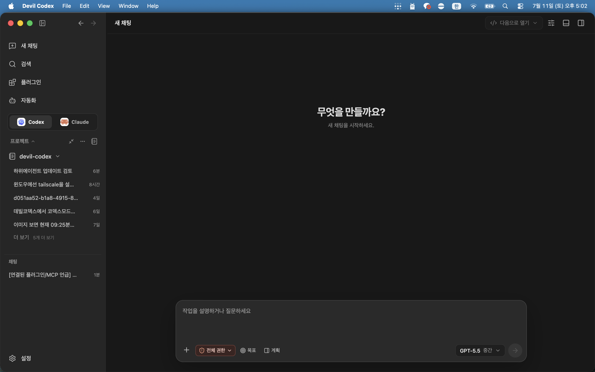
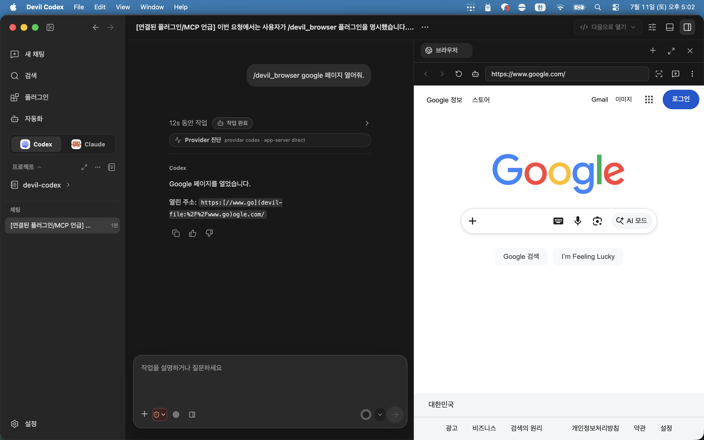
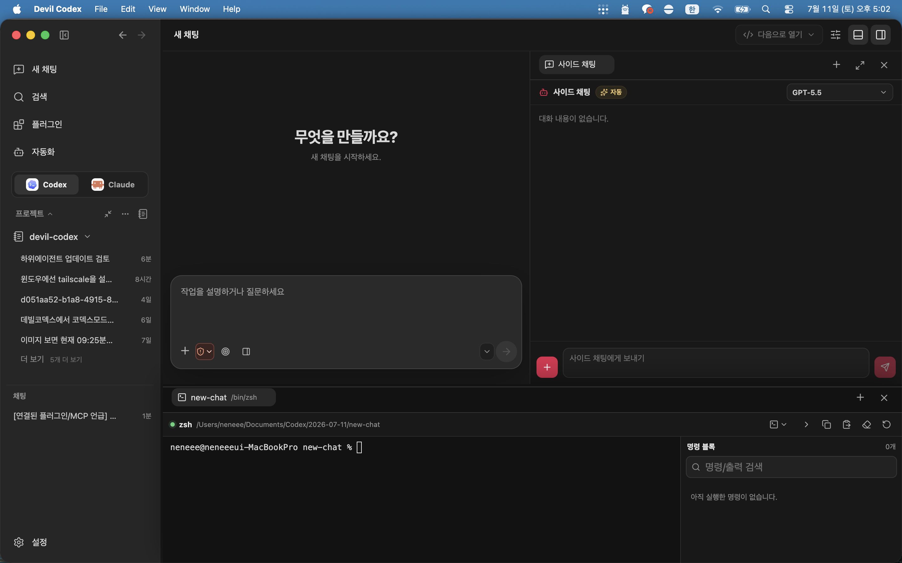
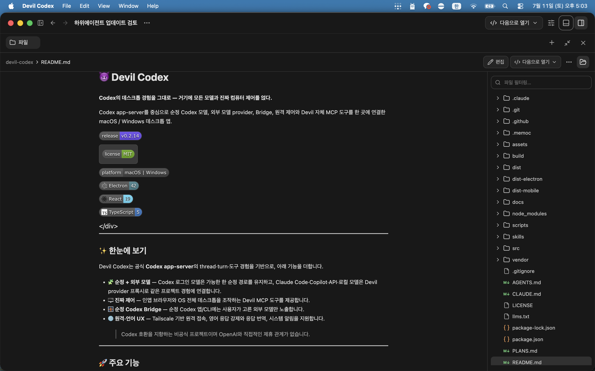
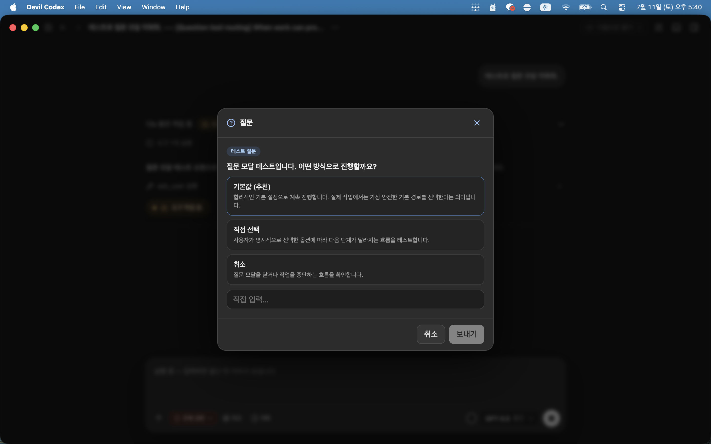
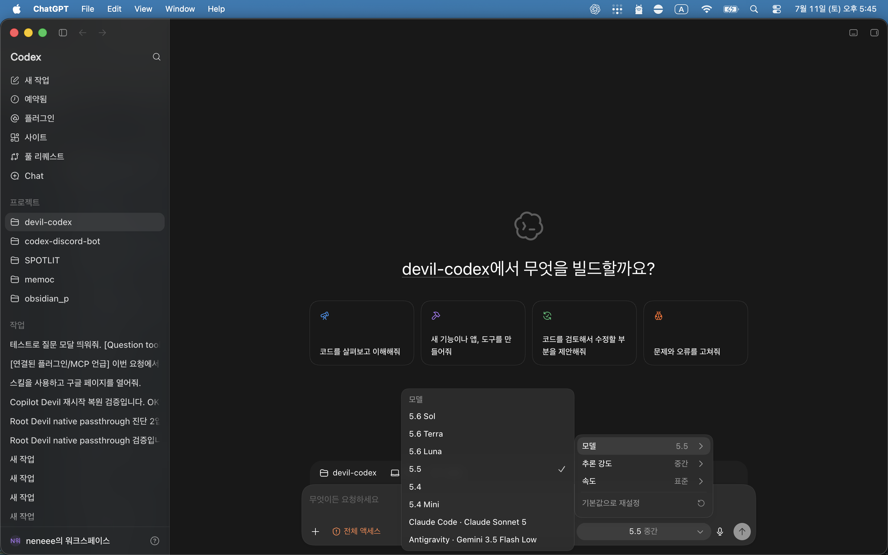

<div align="center">

# 😈 Devil Codex

**[한국어](README.md) · [English](README.en.md) · [简体中文](README.zh-CN.md)**

**The Codex desktop experience — with every model and real computer control.**

A macOS / Windows desktop app built around Codex app-server, bringing native Codex models, external model providers, Bridge, remote control, and Devil MCP tools together.

[](https://github.com/neneee0181/Devil-Codex/releases)
[](LICENSE)
[](https://github.com/neneee0181/Devil-Codex)
[](https://www.electronjs.org/)
[](https://react.dev/)
[](https://www.typescriptlang.org/)

</div>

---

<p align="center">
  
  <br />
  <sub>Devil Codex main chat — projects, model selection, permissions, and planning in one view</sub>
</p>

---

## ✨ At a glance

Devil Codex builds on the official **Codex app-server** thread, turn, and tool experience with the following additions.

- 🧩 **Native + external models** — Codex-login models stay on the native route where possible; Claude Code, Copilot, API, and local models join the same project experience through the Devil provider proxy.
- 🖥️ **Real control** — Devil MCP tools can operate the in-app browser and the full OS desktop.
- 🌉 **Stock Codex Bridge** — exposes only the external models you choose in the stock Codex app/CLI.
- 🌐 **Remote and language UX** — Tailscale-based remote access, forced English output, response translation, and system notifications.

> Devil Codex is an unofficial project designed for Codex compatibility and is not affiliated with OpenAI.

---

## 🖼️ Screenshots

| In-app browser control | Side chat + terminal |
| --- | --- |
| <br /><strong>Browser control</strong><br />Devil MCP opens and operates the in-app browser. | <br /><strong>Parallel workspace</strong><br />Use a side chat and a real workspace terminal at the same time. |

| File browsing and preview | Structured question modal |
| --- | --- |
| <br /><strong>File tab</strong><br />Browse project files and preview Markdown directly from the right tab. | <br /><strong>Devil Ask</strong><br />Collect the choice needed to continue work in a structured question modal. |

<p align="center">
  
  <br />
  <strong>Stock Codex Bridge</strong><br />
  <sub>Only the external models selected in Settings are added to the stock Codex picker; native GPT models always appear first.</sub>
</p>

---

## 🚀 Key features

### Multi-model providers

Switch providers and models from one UI. Codex-login models keep their direct app-server route; external models use Devil's local provider proxy.

| Category | Current route |
| --- | --- |
| Codex | Direct app-server execution with an enhanced native model catalog |
| Login providers | Claude Code · GitHub Copilot · Antigravity |
| API / hosted providers | OpenAI-compatible · Anthropic · Google · DeepSeek · xAI · OpenRouter · NVIDIA NIM, and more |
| Local providers | Ollama · vLLM · LM Studio |

- 🔐 API keys and OAuth credentials use Electron `safeStorage` / the OS secure store.
- 🧠 Web-search and image-description sidecars can optionally assist external models.
- 🧵 External-provider chats are managed to preserve both Devil transcripts and Codex thread continuity.
- ☀️ GPT-5.6 Sol · Terra · Luna are added to the native Codex catalog and use the native route for accounts with access.

### Stock Codex model picker integration

Use external models in the stock Codex app/CLI even after closing Devil Codex.

- Turn Bridge on or off at `Settings → Configuration → Bridge`.
- Native GPT models always appear first.
- Only external models added under `Models to show in stock Codex` appear afterward, in the order you set.
- There is no selection limit; use the up/down controls to change display order.
- Turning Bridge off removes external models from stock Codex but preserves your selection for later restoration.
- Web-search and image-description sidecars can also be enabled for the selected external models in stock Codex.

> The stock Codex picker uses one OpenAI transport. The local Bridge transforms external-model requests, while native Codex requests retain their original body, authentication, and response on the Codex backend.

### Devil MCP tools

These are Devil-specific tools the model can call; only enabled tools are registered in Settings.

- 🌍 **Browser control** — navigate, click, and type in the in-app browser
- 🖱️ **Computer control** — control mouse, keyboard, and screenshots across the OS desktop
- ❓ **Ask user** — a structured multiple-choice question modal
- 🧑‍💻 **Subagents** — delegate independent work to an external provider/model

Subagents never exceed the saved Codex approval policy or sandbox scope, and return timeout, interruption, and empty-result states explicitly.

### Workflow & UX

- 💬 **Request queue + steering** — queue follow-up requests during work, or interrupt and prioritize one when needed.
- 🧵 **Threads** — create, resume, search, archive, and preserve right/bottom tool-tab state per thread.
- 🗂️ **Development environment** — multi-projects, Git worktrees, changed files, unified diffs, file/hunk stage/unstage/revert, and inline review.
- ⌨️ **Tools** — built-in terminal, Git branch/commit/push, and opening external editors/terminals.
- 🔔 **Personalization** — background notifications, forced English output, and response translation.

### 🌐 Remote control

- Connect from a mobile device/browser with Tailscale Funnel or a direct Tailnet address.
- Manage tokens and approved devices.
- Show, read, and send only the threads explicitly allowed for remote access.

---

## ⚙️ Settings layout

`Settings → Configuration` is separated into task-focused tabs.

| Tab | Contents |
| --- | --- |
| General | App information, approval policy, sandbox, terminal, browser, language |
| Tools | Devil MCP, Ask User, subagents, browser/computer control |
| Remote | Tailscale, access addresses, devices, allowed threads |
| Bridge | External-model selection for stock Codex and sidecars |
| Sidecar | Web-search and image-description helpers for external models inside Devil |

---

## 🧱 Architecture in one view

```text
React renderer  ──IPC──▶  Electron main  ──▶  Codex app-server (native Codex models)
                                   │
                                   ├─ Devil provider proxy ─▶ external provider API / OAuth / local models
                                   ├─ Devil MCP ────────────▶ browser / computer / ask / subagent
                                   ├─ Stock Codex Bridge ───▶ selected model catalog for stock Codex app/CLI
                                   └─ Remote server ────────▶ Tailscale-based remote web
```

---

## 📦 Requirements

- **Node.js 22+**
- **Codex CLI** or an available Codex account
- macOS or Windows

> Codex-login models use Codex authentication. External models use each provider's API key, OAuth, or local endpoint.

---

## 🛠️ Install & run

```bash
# 1) Install dependencies
npm install

# 2) Start development mode
npm run dev
```

### Build / package

```bash
npm run build        # renderer + mobile UI + Electron main
npm run dist:win     # Windows installer
npm run dist:mac     # macOS app
```

---

## 🔒 Security notes

- Never place API keys, OAuth credentials, remote tokens, or other secrets in chats, commits, logs, or screenshots.
- Bridge and remote control can make real external requests or remote connections; enable them only when needed.

---

## ⬇️ Download

Get the latest installer from [**Releases**](https://github.com/neneee0181/Devil-Codex/releases). Pushing a `v*` tag runs the GitHub Actions release workflow.

> Windows SmartScreen or macOS Gatekeeper may show a warning depending on code-signing status.

## 📄 License

[MIT](LICENSE) © 2026 neneee0181

<div align="center">
<sub>Unofficial project designed for Codex compatibility. Not affiliated with OpenAI.</sub>
</div>
